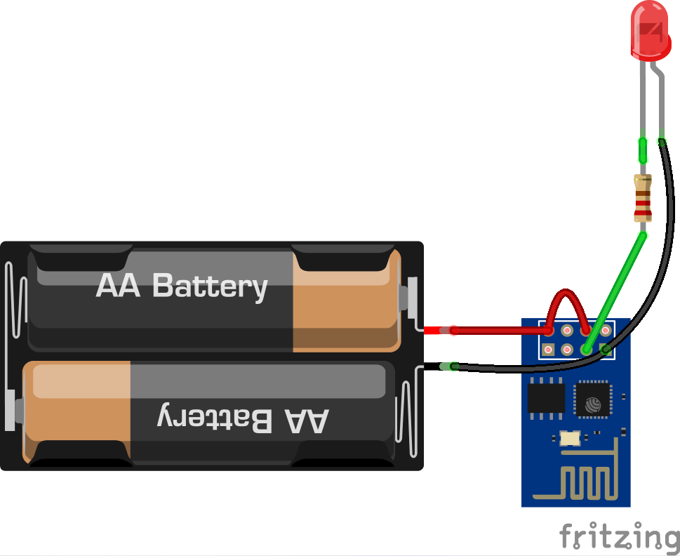

# ESP8266

An extensive source of information about this module can be found [here](https://github.com/esp8266/esp8266-wiki/wiki)

There is a README inside each library directory (libraries/{C,lua}) for the API Reference

## Schematics

For the examples in this repository you should follow these schematics:

Button example:

Led example:

## C

To build and flash these examples, you will need to build the tool chain and libraries for the chip. We suggest to get them from the [esp-open-sdk](https://github.com/pfalcon/esp-open-sdk) project since it simplifies the process. After that, you just should enter the directory of the project you choose and run `make` and `make flash`.

Remember to configure the TOKEN, SSID and SSID\_PASSWORD from the user\_config.h file before flashing the program

## Lua

Before using those examples you should flash the [NodeMCU](http://nodemcu.com) firmware to the esp8266. This firmware allows you to run lua scripts in it with this [API](https://github.com/nodemcu/nodemcu-firmware/wiki/nodemcu_api_en).

Flash this firmware using the [esptool](https://github.com/themadinventor/esptool) tool:
`esptool.py --port /dev/ttyUSB0 write_flash 0x00000 nodemcu.bin`

Edit the Led.lua script to suit your needs (SSID/PASSWORD/TOKEN).

Restart the esp8266 and use [luatool](https://github.com/4refr0nt/luatool) to upload the script:
`luatool.py -sdr -f Led.lua -t init.lua -p /dev/ttyUSB0`

Then you can see the output of the script or open the interpreter with any serial port application:
`picocom -b 9600 /dev/ttyUSB0`
